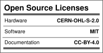

# IS2026 Spring - Dementia Band
___

## Problem Statement
Patients suffering from memory related disorders such as Dementia or Alzheimer's often wander off from their familiar surroundings especially during the early stages of this disease. This poses a threat to their safety and creates a sense of panic and chaos in their families especially if the family members are travelling or geographically live at a distance from the patient. This band is designed as a solution to help patients and their families in such situations.
___

## Solution
This band is designed as a safety device worn by the patient which sends a notification or contacts a few emergency contacts if the patient wanders out of a set safe location. We will achieve this by using GPS technology to determine the patients location and set a geo- fence and then implement GSM technology to contact the caregivers.
___

## Additional Information
The inspiration of the project came from one of our team member Meghashree's grandfather who recently passed away and had suffered from Dementia for 10 years. Throughout her life Meghashree witnessed multiple incidents where her grandfather wandered off into unknown locations causing panic and tension in the family who lived in a different state from him. The situation was even harder to control because most of the family lived in a different state and was not able to locate him and handle the situation from there. This project was thus inspired by this issue faced by Meghashree and many other families to aid them in this difficult time.

## License

Licenses

#### Hardware
CERN Open Hardware License Version 2 - Strongly Reciprocal ([CERN-OHL-S-2.0](https://spdx.org/licenses/CERN-OHL-S-2.0.html)).

#### Software
MIT open source [license](http://opensource.org/licenses/MIT).

#### Documentation:
 This work is licensed under a <a rel="license" href="http://creativecommons.org/licenses/by/4.0/">Creative Commons Attribution 4.0 International License</a>.

---

## 📬 Contact/Team

> _List team members and contact emails or GitHub profiles._

[Meghashree Nambiar](https://github.com/Meghashree-11)

[Tanya Bhoopalam](https://github.com/tanyabhoopalam-prog)

[Aaryan Agarwal](https://github.com/Aaryan-026)

[@anool](https://github.com/Anool)

> ---
